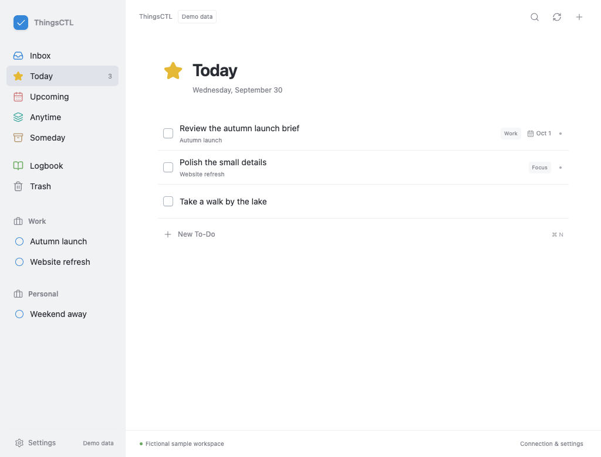

# ThingsCTL

A Things 3 command-line tool and interactive ChatGPT/Codex plugin for macOS. Inspired by [RemCTL](https://github.com/viticci/remctl), with one shared command service behind terminal commands, chat tools, and a Things-style workspace.

Things remains your task store. ThingsCTL uses documented local AppleScript automation, with no Things database access or Things Cloud credentials. This is an independent project, not affiliated with Cultured Code.



*The screenshot shows explicitly labeled fictional demo data. The installed app connects to your local Things library.*

## Install on a Mac

The **v0.1.4 installer candidate** fixes macOS background-item attribution by starting the signed ThingsCTL Bridge directly. Use **thingsctl-v0.1.4-macos-arm64.dmg** when it becomes available in the [release downloads](https://github.com/kianhub/thingsctl/releases), open it, and double-click **Install ThingsCTL**. Signed downloads are published only after Apple accepts the submissions and the signature, ticket, and Gatekeeper checks pass.

The existing **v0.1.2 macOS arm64 ZIP is a development build and is not notarized**. macOS may block its `Install ThingsCTL.command` launcher. Preparing the signing workflow does not change that published archive.

You need macOS 14+, Things 3, Python 3.9+, and a recent Codex CLI. The installer installs the ThingsCTL Bridge, CLI, and local plugin. When macOS asks, allow **ThingsCTL Bridge** to control Things.

For a source install, including Intel Macs with Xcode Command Line Tools:

```sh
mkdir -p ~/Developer
cd ~/Developer
git clone https://github.com/kianhub/thingsctl.git
cd thingsctl
./install.sh
```

The bundled workspace needs no Node.js installation. See [installation and recovery](docs/INSTALLATION.md) for prerequisites, the terminal flow, and uninstalling.

Select ThingsCTL in ChatGPT or Codex and ask **“Open my Things workspace.”** The plugin also registers **ThingsCTL** in global navigation and **ThingsCTL workspace** in conversation panels. Installing on another Mac connects to Things on that Mac; it does not relay tasks through the first Mac.

## Workspace and commands

The workspace includes Inbox, Today, Upcoming, Anytime, Someday, Logbook, Trash, areas and projects, Quick Entry, inline task editing, tags, separate When and Deadline controls, and connection settings. The same tools are available in chat and the CLI.

```sh
thingsctl doctor --json
thingsctl list today --limit 20 --json
thingsctl search "launch" --tag Work --json
thingsctl get TASK_ID --json
thingsctl add "Review launch brief" --when today --project PROJECT_ID --json
thingsctl update TASK_ID --deadline 2026-10-09 --json
thingsctl complete TASK_ID --json
thingsctl mcp serve
```

Replace `TASK_ID` and `PROJECT_ID` with IDs returned by ThingsCTL. Other commands include cancel, reopen, move, trash, and creating projects, areas, and tags. Use `thingsctl --help` for the full command list.

Changes use operation IDs, optional revision checks, and read-back verification. Results distinguish verified, failed, and uncertain writes. An uncertain write is not automatically repeated. Queries are bounded and report pagination and completeness.

## Current scope

Core task reads, titles, notes, status, dates, deadlines, tags, and parent moves are implemented. When and Deadline are separate. The live disposable integration flow verifies text, scheduling, Deadline set/clear, project moves, status changes, conflicts, and Trash. Direct tag edits and area/tag creation still need live verification.

Project-task Anytime/Someday changes are unavailable because public readback cannot reliably confirm them. Missing start kinds remain unknown; Today and explicit dates are supported. Built-in collections follow Things’ public automation membership and may omit nested tasks.

Headings, checklists, Evening, timed reminders, recurrence authoring, arbitrary reordering, and richer Shortcuts metadata are not connected features. See [capabilities and limits](docs/CAPABILITIES.md).

The retained Python suite has 51 tests, and the existing synthetic UI workflow checks field preservation, conflicts, uncertain writes, and light/dark layouts. The live conversation-panel app was inspected with Things 3.24. Native global-sidebar launching and selected-task context remain unverified. Demo mode is explicit; failed live connections never substitute fictional tasks.

## Development and distribution

The source and MIT license are public. The repository marketplace and downloadable release packages distribute the local plugin; no public plugin-directory submission is required. See [plugin distribution](docs/PLUGIN.md).

Maintainers can build the signed DMG with [the notarization workflow](docs/INSTALLATION.md#publisher-signing-and-notarization). Source installs remain ad-hoc signed by default; end users do not need a notarization profile.

Production UI source is in `ui/src/`, and its self-contained build is `ui/dist/things-workspace.html`. End-user installs use the checked-in bundle. Full licenses for bundled dependencies are in `ui/THIRD-PARTY-NOTICES.txt`.

- [Implementation plan](docs/PLAN.md)
- [Architecture](docs/ARCHITECTURE.md)
- [Visual direction](docs/DESIGN.md)
- [Testing](docs/TESTING.md)
- [Original concept](ui/things-workspace-concept.html), using fictional data

Report bugs and suggest improvements through [GitHub issues](https://github.com/kianhub/thingsctl/issues).
