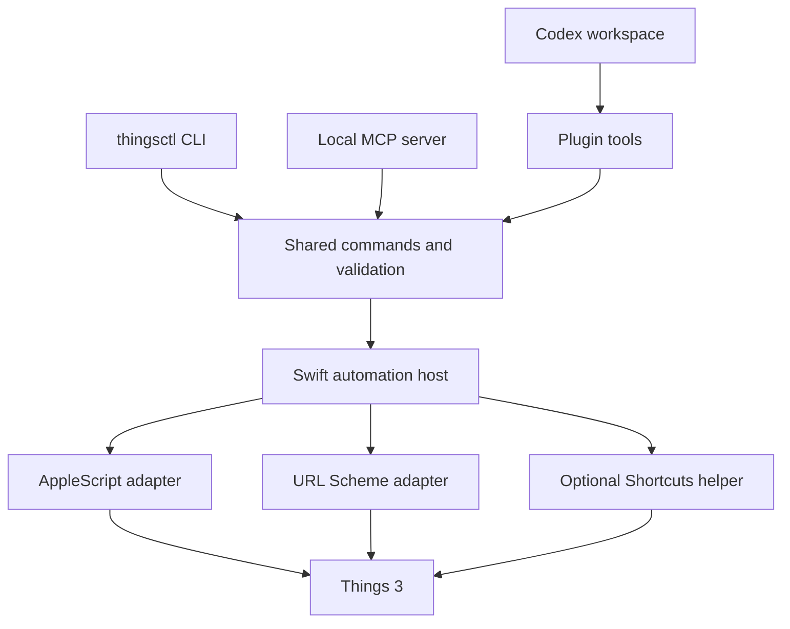

# Architecture

## Proposed stack

Python shared command layer for CLI and MCP, a small Swift macOS host for AppleScript and stable Automation permission identity, and a bundled React and TypeScript workspace. Confirm host signing and Shortcuts execution identity in the first integration spike. This stack follows RemCTL's separation of surfaces without importing its Reminders-specific backend.

## Model and adapters

Model Task, Project, Area, Heading, ChecklistItem, Tag, and BuiltInView explicitly. Keep `when`, `evening`, `reminderAt`, `deadline`, `status`, parent IDs, directly applied tags, and inherited tags separate. Use local calendar dates for date-only fields and timezone-aware values for actual reminder times.

Each result records adapter capabilities and field availability. Unknown checklist or heading data must not become an empty checklist or an ungrouped task. Native list membership drives built-in views; do not recreate Today solely from a deadline filter. Query and indexing operate on bounded supported snapshots. Cache only derived data, never a second authoritative task store.

AppleScript provides the core read and mutation path. URL JSON handles supported structured creation. Optional Shortcuts enriches fields AppleScript cannot expose. Bundle a documented helper that the user imports; confirm JSON export, partitioning, latency, and update behavior before making the richer workspace a release promise.

## Request and mutation contract

Use one typed command vocabulary across all surfaces. Return JSON envelopes with request ID, stable item IDs, available fields, data completeness, and operation status. Validation happens before dispatch. Prefer structured arguments to generated script strings; never interpolate user text as executable AppleScript.

Every mutation carries a durable operation ID and input hash. Save a local journal with minimal sensitive content. Return `verified`, `failed`, or `uncertain`; reusing an operation ID never creates a second task. Verify the change with a supported read route. If read-back is unavailable, state that result explicitly. A process interruption or URL launch is not a success receipt.

Before saving a task, compare an observed revision derived from supported metadata and relevant fields. If Things changed since the editor loaded, return a conflict and reload options. Cross-app writes cannot be advertised as atomic transactions; batch results are per operation, and partial success remains visible.

## Local service and installation

The automation host should have a stable signing identity and owner-only Unix socket. Expose only explicit typed operations. Keep a browser preview on loopback with request authentication and origin checks; no unauthenticated network mutation endpoint. The MCP server starts with read tools, adding explicit mutation tools after the adapter gate passes.

A diagnostic command reports Things presence/version, Automation access, optional helper availability, and supported operations. No Full Disk Access requirement is planned. Store an optional URL auth token in Keychain and redact it from every model-facing or diagnostic result. Separate integration installation from plugin registration. Packaging and notarization follow after behavior is validated.

## Reliability references

The reliability goals are informed by [RemCTL architecture](https://github.com/viticci/remctl/blob/main/docs/architecture.md) and [workspace mutation handling](https://github.com/viticci/remctl/blob/main/remctl_plugin.py). They are design requirements for this new implementation, not implemented guarantees.
