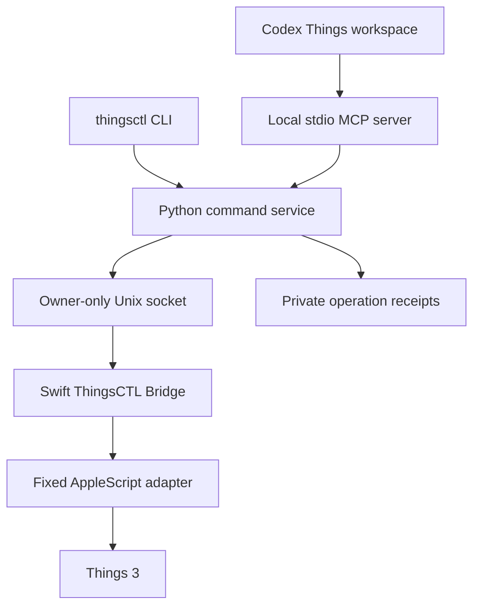

# Architecture

## Implemented stack

The CLI and local MCP server use a shared Python command service in `thingsctl_pkg/`. A Swift macOS app owns the Automation permission identity and executes the bundled, fixed AppleScript adapter. The React/TypeScript workspace is a self-contained MCP App built with the supported MCP Apps and OpenAI Extensions SDKs.

These components are implemented and tested with fixtures. Swift and AppleScript compile. Native list lookup and an authorized disposable mutation round trip are still validation gates; the diagram describes the code path, not a completed live integration proof.

## Shared model

Tasks expose stable IDs, titles, notes, status, `when`, `whenKind`, Deadline, timestamps, parent project/area IDs, directly applied tags, native list membership, available fields, and a revision. Snapshots include projects, areas, tags, lists, pagination, totals, and adapter capabilities. Date-only fields use local calendar dates. `whenKind` distinguishes Anytime, Someday, and scheduled placement; Deadline is independent.

Headings, checklists, Evening, reminder times, recurrence rules, and arbitrary ordering are unavailable in this adapter. The service rejects unsupported edit fields, and the UI gates controls by field availability. Unknown metadata must not become an empty checklist or a fabricated heading.

Native Things lists supply built-in views. The service searches bounded snapshots and reports incomplete results when the scan or result limit is reached. There is no second authoritative task store and no access to the Things database. The operation journal is ThingsCTL's own SQLite receipt file; it is not a copy of Things data.

## Commands and mutation receipts

CLI and MCP arguments pass through the same validation and execution layer. User text travels as structured arguments to a fixed AppleScript handler; clients cannot supply executable AppleScript or invoke arbitrary handlers.

Mutations carry an operation ID and an input hash. The journal claims an ID before dispatch, persists its outcome, rejects reuse with different arguments, and returns an existing receipt for an identical completed operation. Pending or uncertain operations are not dispatched again. The browser retains the same ID after a transport failure and never retries a write automatically.

Supported edits use a pre-save revision check when an observed revision is supplied. Revisions derive from exposed editable fields. Read-back compares the supported resulting fields before returning `verified`; errors are `failed` or `uncertain` according to whether dispatch and its outcome can be determined. Interrupted writes and verification failures remain visible. The fixture tests cover these mechanisms; their native behavior still needs integration evidence.

A revision check cannot make cross-app changes atomic. A native edit can occur between the comparison and write. The inline editor preserves drafts, displays the latest task on conflict, and asks the user to review the chosen version before another save.

The owner-only journal stores structured receipts, which can include task content. It is private local state rather than a content-free log. Do not include it in a release, diagnostics export, or repository.

## Plugin and workspace

The Python server exposes read tools, explicit mutations, workspace snapshot/mutation tools, a fullscreen HTML resource, global and thread entrypoints, and structured preference tools. The production UI uses the MCP Apps host bridge; it has no custom browser-to-backend HTTP mutation route or external asset dependency.

The workspace uses the opener's initial tool result. Later list loads, writes, diagnostics, and preferences call the same server. The OpenAI Extensions model-context bridge attaches explicitly selected tasks without automatically sending a message. These host-dependent behaviors remain subject to installed Codex verification; fixture browser tests cover the controls and state transitions.

The build pins `@modelcontextprotocol/ext-apps` 1.7.5 and `@openai/mcp-extensions` 0.1.0 to a supported peer combination. Bundled dependency license texts accompany the HTML. Appearance follows the host unless the user selects an explicit theme.

## Native transport and installation

The host listens on an owner-only Unix socket under `~/Library/Application Support/ThingsCTL/`. It validates the connecting user's identity and accepts only explicit commands. The Python client validates socket type, ownership, and permissions. It can start the fixed installed bridge app when no request has been dispatched; it does not automatically repeat an interrupted mutation.

`./install.sh` builds an ad-hoc-signed `ThingsCTL Bridge.app` with identifier `com.kianhub.thingsctl.bridge`, installs the CLI launcher, stages the plugin runtime and HTML, and registers the plugin through supported Codex commands. Ownership records, backup/recovery behavior, a login LaunchAgent, and uninstall support are implemented. See [installation](INSTALLATION.md).

The bridge requires a macOS Automation grant to control Things. A rebuild may require renewing that grant. No Things Cloud credential, Full Disk Access, Accessibility permission, or URL auth token is required by v0.1. The development build is not notarized.

## Deferred adapters

No URL Scheme mutation adapter or Shortcuts helper is included. A future richer adapter must prove serialization, query completeness, permissions, and supported read-back before exposing its fields. Any future URL auth token belongs in macOS Keychain and must remain absent from model context and diagnostics.

The separation of surfaces was informed by [RemCTL](https://github.com/viticci/remctl). This repository implements an independent Things backend and workspace rather than importing the Reminders-specific source.
